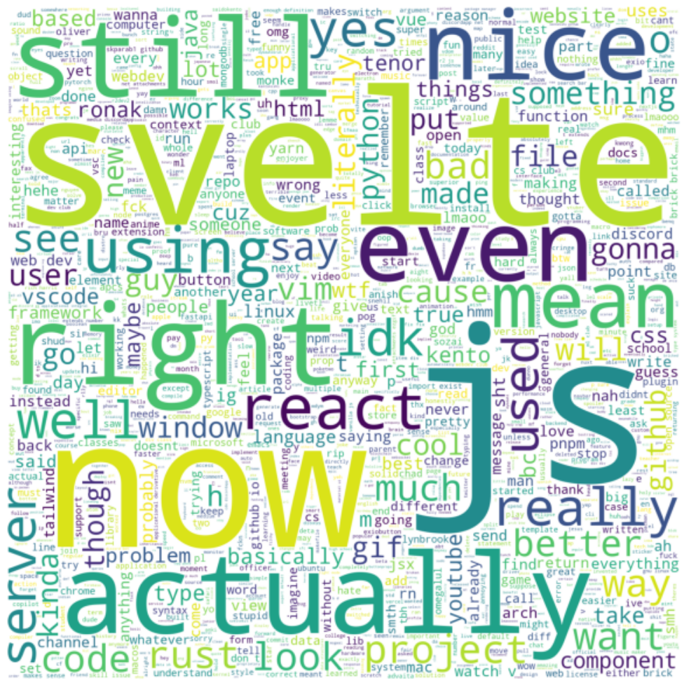
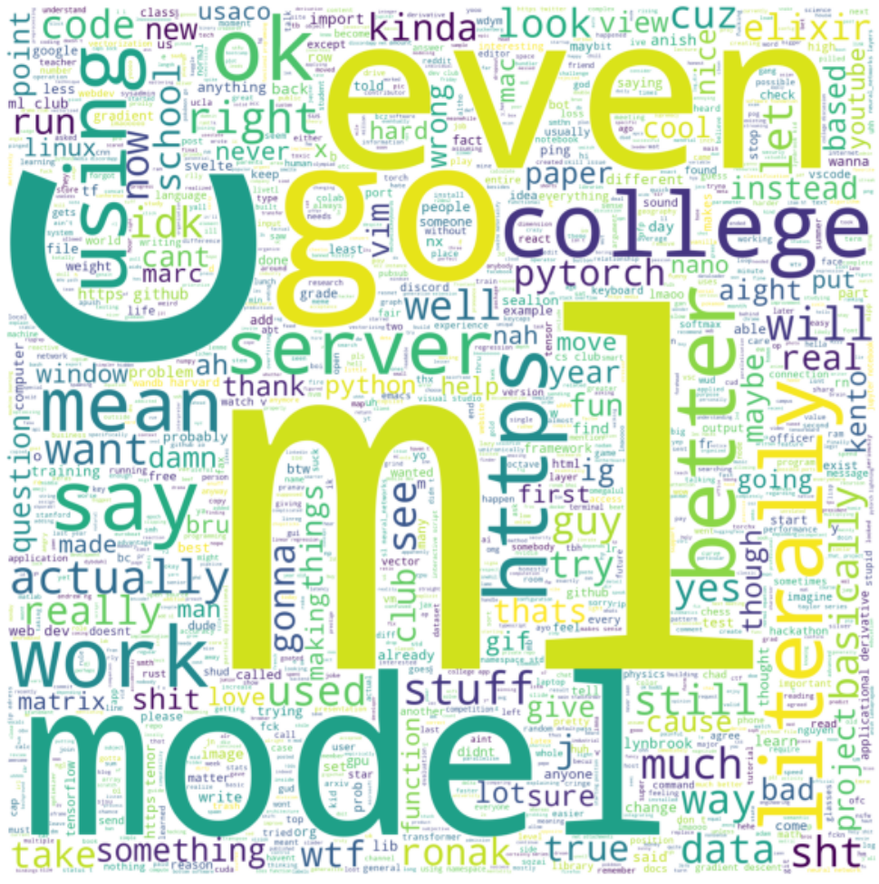
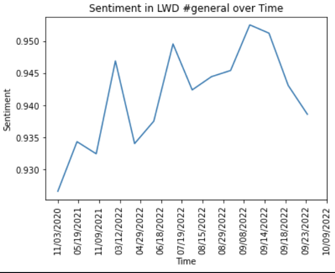
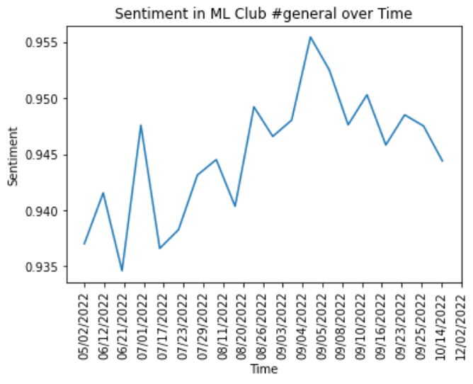

# [Basic NLP Analysis of Discord Channels](https://anish-lakkapragada.github.io/discord-nlp/)

> Tech 🥪: Svelte.js w/ [Sozai](https://github.com/r2dev2/sozai) UI, FastAPI Backend running on an Oracle VM exposed with Ngrok.

This is the repository for the website to analyze messages in a Discord Channel. The project was motivated to first analyze the thousands of messages on the [Lynbrook Web Dev Club](https://discord.gg/FWRN5bqq5v) and [Machine Learning Club](https://discord.gg/gVQBu6K6ad) Discord #general channels.

If you would like to do the same, please go to the website [here](https://anish-lakkapragada.github.io/discord-nlp/).

## WordClouds 

> Certain words that have no meaning or contain no flavor about the server were removed so that the WordClouds can be informative. LWD's most common word is "bruh".

#### Web Dev Club 

<figure>
    
    <figcaption> LWD club really loves Svelte.js more than React. </figcaption>
</figure>

#### Machine Learning Club 

<figure>
    
    <figcaption> Bruh why is college bigger than PyTorch?? </figcaption>
</figure>

## Sentiment Analysis Over Time

> The figures below track the positive/negative sentiment on average for all the messages in the #general channel of the servers through [Hugging Face's sentiment analysis](https://huggingface.co/distilbert-base-uncased-finetuned-sst-2-english). Note that the dates on the x-axis are not necessarily spaced out evenly. 

#### Web Dev Club
<figure>
    
    <figcaption> General positive trend, but what was going on from March to April 2022? </figcaption>
</figure>

#### Machine Learning Club 
<figure>
    
    <figcaption> Bro, why were we talking so much during September 3rd-4th? </figcaption>
</figure>
